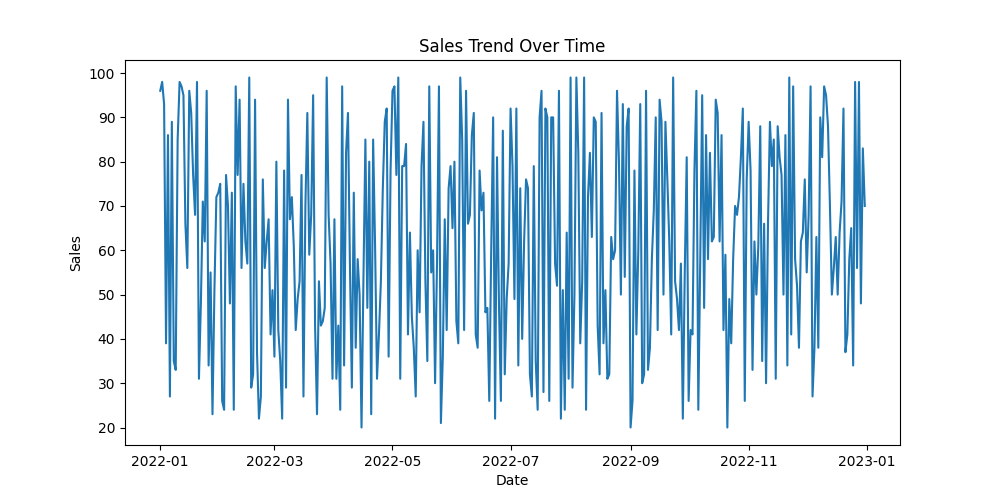
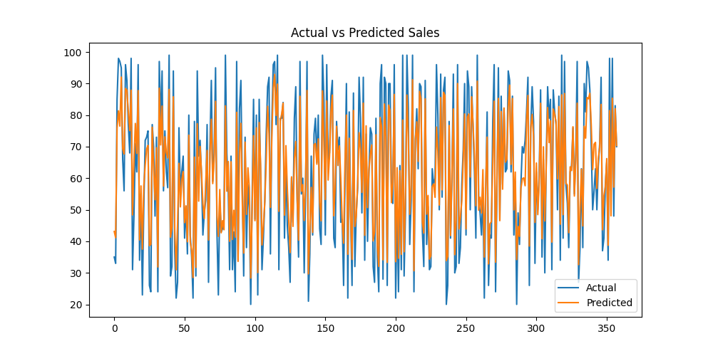

# 🛒 Retail Sales Forecasting & Inventory Optimization System

## 📌 Project Overview

This project builds an end-to-end system that predicts future retail sales and optimizes inventory decisions such as safety stock and reorder points. It simulates real-world retail scenarios using synthetic data and machine learning models.

---

## 🎯 Problem Statement

Retail businesses often face:

* ❌ Overstocking → Increased holding costs
* ❌ Stockouts → Lost sales and customer dissatisfaction

This project solves these problems by:

* Forecasting future demand
* Optimizing inventory levels

---

## 💼 Industry Relevance

Used by companies like Amazon, Flipkart, Reliance Retail, and Walmart to improve demand planning, reduce losses, and increase profits.

---

## 🚀 Features

* 📊 Sales Forecasting using Machine Learning
* 📦 Inventory Optimization (Safety Stock, Reorder Point)
* 📈 Data Visualization
* 📁 Modular Project Structure
* 🧪 Synthetic Data Simulation

---

## 🛠️ Tech Stack

* Python
* Pandas, NumPy
* Matplotlib, Seaborn
* Scikit-learn
* Joblib

---

## 🏗️ Project Architecture

Data → Preprocessing → Feature Engineering → Model → Forecast → Inventory Optimization → Output

---

## 📂 Folder Structure

Retail-Sales-Forecasting/
│
├── data/
├── notebooks/
├── src/
├── models/
├── outputs/
├── images/
├── app/
│
├── main.py
├── requirements.txt
├── README.md

---

## ⚙️ Installation

git clone <your-repo-link>
cd Retail-Sales-Forecasting

python -m venv venv
venv\Scripts\activate   (Windows)

# source venv/bin/activate (Mac/Linux)

pip install -r requirements.txt

---

## ▶️ How to Run

python generate_data.py
python main.py

---

## 📊 Results

### 📌 Dataset Preview

### 📈 Sales Trend

### 📉 Forecast vs Actual

### 📦 Inventory Optimization

---

## 🧠 Key Concepts Used

* Time Series Forecasting
* Feature Engineering (Lag, Rolling Mean)
* Random Forest Regression
* Safety Stock Calculation
* Reorder Point (ROP)

---

## 📦 Inventory Logic

* Safety Stock = Buffer stock for uncertainty
* Reorder Point = When to reorder inventory

---

## 🎯 Output Example

Safety Stock: 102.45
Reorder Point: 575.27

---

## 🔮 Future Improvements

* Multi-store forecasting
* Deep learning models (LSTM)
* Real-time dashboard (Streamlit)
* API integration
* Promotion impact analysis

---

## 📚 Learning Outcomes

* Built an end-to-end ML pipeline
* Learned demand forecasting
* Applied inventory optimization techniques
* Understood real-world retail analytics

---

## 👩‍💻 Author

Aneesha Varma
Aspiring Data Scientist | AI & ML Enthusiast

---

## ⭐ If you like this project

Give it a ⭐ on GitHub!
